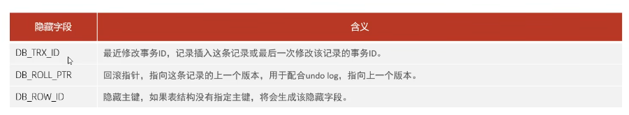
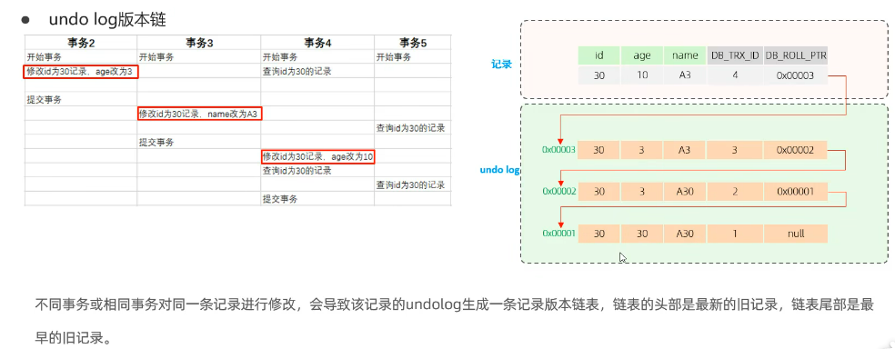
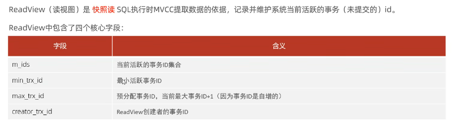
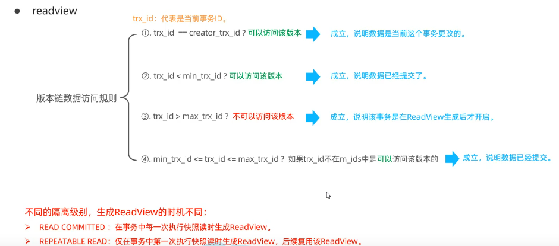
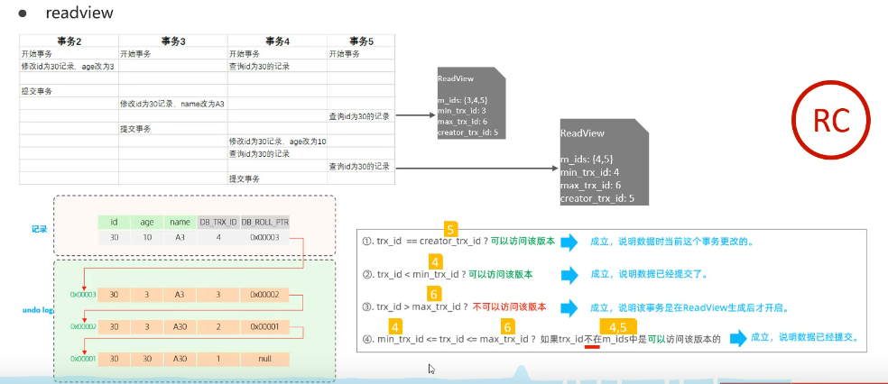
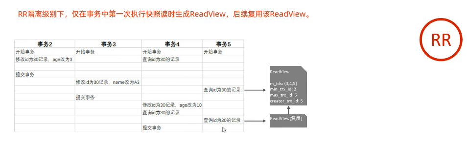

# 基本概念
-- 当前读
读取的是记录的最新版本，读取时还要保证其他并发事务不能修改当前记录，会对读取的记录进行加锁。对于我们日常的操作，如:select ... lock in share mode(共享锁)，select ... for update、update、insert、delete(排他锁)都是一种当前读。
-- 快照读
简单的select(不加锁)就是快照读，快照读，读取的是记录数据的可见版本，有可能是历史数据，不加锁，是非阻塞读。
Read Committed:每次select，都生成一个快照读。
Repeatable Read:开启事务后第一个select语句才是快照读的地方
Serializable:快照读会退化为当前读。
-- MVCC
全称 Multi-Version Concurencyb Control，多版本并发控制。指维护一个数据的多个版本，使得读写操作没有冲突，快照读为MySQL实现MVCC提供了一个非阻塞读功能。MVCC的具体实现，还需要依赖于数据库记录中的三个隐式字段、undolog日志、readView。

-- 隐藏字段

-- undo log
回滚日志，在insert、update、delete的时候产生的便于数据回滚的日志。
当insert的时候，产生的undolog日志只在回滚时需要，在事务提交后，可被立即删除。
而update、delete的时候，产生的undo log日志不仅在回滚时需要，在快照读时也需要，不会立即被删除。
-- undo log版本链

-- readview

