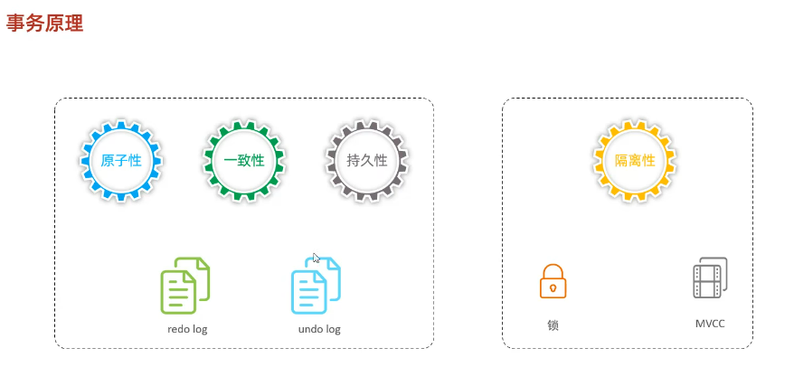

# redo log
-- 重做日志，记录的是事务提交时数据页的物理修改，是用来实现事务的持久性。
该日志文件由两部分组成:重做日志缓冲(redo log buffer)以及重做日志文件(redo log file),前者是在内存中，后者在磁盘中。当事务提交之后会把所有修改信息都存到该日志文件中,用于在刷新脏页到磁盘,发生错误时,进行数据恢复使用。
-- 脏页刷新是随机写入，rodolog是顺序写入WAL性能高。
# undo log
-- 回滚日志，用于记录数据被修改前的信息，作用包含两个:提供回滚 和 MVCC(多版本并发控制)。
-- undo log和redo log记录物理日志不一样，它是逻辑日志。可以认为当delete一条记录时，undo log中会记录一条对应的insert记录，反之亦然，当update一条记录时，它记录一条对应相反的update记录。当执行rollback时，就可以从undolog中的逻辑记录读取到相应的内容并进行回滚。
-- Undolog销毁:undolog在事务执行时产生，事务提交时，并不会立即制除undolog，因为这些日志可能还用于MVCC。
-- Undolog存储:undolog采用段的方式进行管理和记录，存放在前面介绍的 rolbackseament 回滚段中，内部包含1024个undoloasegment.