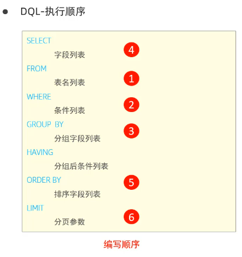

# 数据查询语言

# 删除表
drop table employee;
# 数据准备
-- 创建员工表 emp
CREATE TABLE emp (
    id INT AUTO_INCREMENT COMMENT '编号',
    workno VARCHAR(10) NOT NULL COMMENT '工号',
    name VARCHAR(10) NOT NULL COMMENT '姓名',
    gender CHAR(1) COMMENT '性别',
    age TINYINT UNSIGNED COMMENT '年龄',
    idcard CHAR(18) COMMENT '身份证号',
    workaddress VARCHAR(50) COMMENT '工作地址',
    entrydate DATE COMMENT '入职时间',
    PRIMARY KEY (id),
    UNIQUE (workno)
) COMMENT='员工表';

# 插入数据
insert into emp (id, workno, name, gender, age, idcard, workaddress, entrydate)
values
(1, '1', '柳岩', '女', 20, '123456789012345678', '北京', '2000-01-01'),
(2, '2', '张无忌', '男', 18, '123456789012345670', '北京', '2005-09-01'),
(3, '3', '韦一笑', '男', 38, '123456789712345670', '上海', '2005-08-01'),
(4, '4', '赵敏', '女', 18, '123456757123845670', '北京', '2009-12-01'),
(5, '5', '小昭', '女', 16, '123456789012345678', '上海', '2007-07-01'),
(6, '6', '杨逍', '男', 28, '12345678931234567X', '北京', '2006-01-01'),
(7, '7', '范瑶', '男', 40, '123456789212345670', '北京', '2005-05-01'),
(8, '8', '黛绮丝', '女', 38, '123456157123645670', '天津', '2015-05-01'),
(9, '9', '范琼琼', '女', 45, '123156789012345678', '北京', '2010-04-01'),
(10, '10', '陈友谅', '男', 53, '12356789012345670', '上海', '2011-01-01'),
(11, '11', '张士诚', '男', 55, '12356789123465670', '江苏', '2015-05-01'),
(12, '12', '常遇春', '男', 32, '12346475712345670', '北京', '2004-02-01'),
(13, '13', '张三丰', '男', 88, '123656789012345670', '江苏', '2020-11-01'),
(14, '14', '灭绝', '女', 65, '1236467912345670', '西安', '2019-05-01'),
(15, '15', '胡青牛', '男', 70, '123646791234567X', '西安', '2018-04-01'),
(16, '16', '周芷若', '女', 18, NULL, '北京', '2012-06-01');

# 基本查询
# 查询指定字段并返回
select name,workno,age from emp;
# 查询所有字段并返回
select id,workno,name,gender,age,idcard,workaddress,entrydate from emp;
# 实际开发尽量避免（不直观）
select * from emp;
# 查询指定字段，起别名
select workaddress as'工作地址' from emp;
#查询指定字段，并且不重复
select distinct workaddress from emp;

