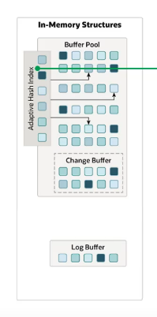
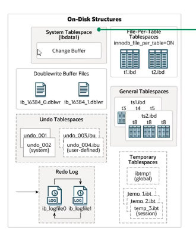
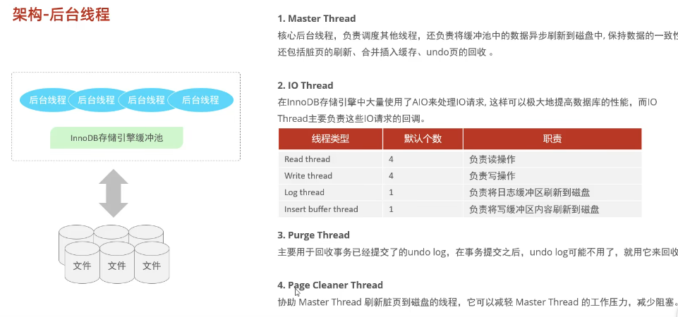

# 内存架构

-- Buffer Pool:缓冲池是主内存中的一个区域，里面可以缓存磁盘上经常操作的真实数据，在执行增删改查操作时，先操作缓冲池中的数据(若缓冲池没有数据，则从盘加载并缓存)，然后再以一定频率刷新到磁盘，从而减少磁盘IO，加快处理速度。
缓冲池以Page页为单位，底层采用链表数据结构管理Page。根据状态，将Page分为三种类型:
free page:空闲page，未被使用。
clean page:被使用page，数据没有被修改过，
dirty page:脏页，被使用page，数据被修改过，也中数据与盘的数据产生了不一致

-- Change Buffer:更改缓冲区(针对于非唯一二级索引页)，在执行DML语句时，如果这些数据Page没有在Buffer Pool中，不会直接操作磁盘，而会将数据变更存在更改缓冲区Change Buffer 中，在未来数据被读取时，再将数据合并恢复到Buffer Pool中，再将合并后的数据刷新到磁盘中。
-- Change Buffer的意义是什么?
与聚集索引不同，二级索引通常是非唯一的，并且以相对随机的顺序插入二级索引。同样，删除和更新可能会影响索引树中不相邻的二级索引页，如果每一次都操作磁盘，会造成大量的磁盘IO。有了ChangeBuffer之后，我们可以在缓冲池中进行合并处理，减少磁盘IO。
-- Adaptive Hash Index:自适应hash索引，用于优化对Buffer Pool数据的查询。InnoDB存储引擎会监控对表上各索引页的查询，如果观察到hash索引可以提升速度，则建立hash索引，称之为自适应hash索引。
show variables like '%hash_index%';

自适应哈希索引，无需人工干预，是系统根据情况自动完成。参数:adaptive hash index
-- Log Buffer:日志缓冲区，用来保存要写入到磁盘中的log日志数据(redolog、undolog)，默认大小为 16MB，日志缓冲区的日志会定期刷新到磁盘中。如果需要更新、插入或删除许多行的事务，增加日志缓冲区的大小可以节省磁盘1/0。
参数:
innodb log buffer size:缓冲区大小
innodb flush log_at trx commit:日志刷新到磁盘时机
show variables like '%log_buffer_size%';
show variables like '%flush_log%';
# 磁盘架构

-- system Tablespace:系统表空间是更改缓冲区的存储区域。如果表是在系统表空间而不是每个表文件或通用表空间中创建的，它也可能包含表和索引数据。(在MySQL5.x版本中还包含InnoDB数据字典、undolog等)
参数:innodb_data_file_path
File-Per-Table Tablespaces:每个表的文件表空间包含单个InnoDB表的数据和索引，并存储在文件系统上的单个数据文件中
参数:innodb_file_per_table

-- GeneralTablespaces:通用表空间，需要通过 CREATE TABLESPACE语法创建通用表空间，在创建表时，可以指定该表空间。

create tablespace ts_idheima add datafile 'myitheima.ibd' engine = innodb;
create table a(id int primary key auto_increment,name varchar(10))engine = innodb tablespace ts_idheima;

-- Undo Tablespaces:撤销表空间，MySQL实例在初始化时会自动创建两个默认的undo表空间(初始大小16M)，用于存储undo log日志。
-- TemporaryTablespaces:InnoDB 使用会话临时表空间和全局临时表空间。存储用户创建的临时表等数据。
-- Doublewrite Buffer Files:双写缓冲区，innoDB引擎将数据页从Buffer Pool刷新到磁盘前，先将数据页写入双写缓冲区文件中，便于系统异常时恢复数据。
1#ib 16384 0.dblwr
2#ib 16384 1.dblwr
-- Redo Log:重做日志，是用来实现事务的持久性。该日志文件由两部分组成:重日志缓冲(redo log buffer)以及重做日志文件(redolog),前者是在内存中，后者在磁盘中。当事务提交之后会把所有修改信息都会存到该日志中,用于在刷新脏页到磁盘时,发生错误时,进行数据恢复使用。

# 后台线程

