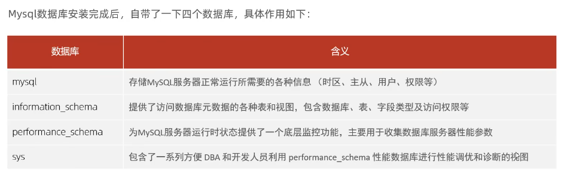
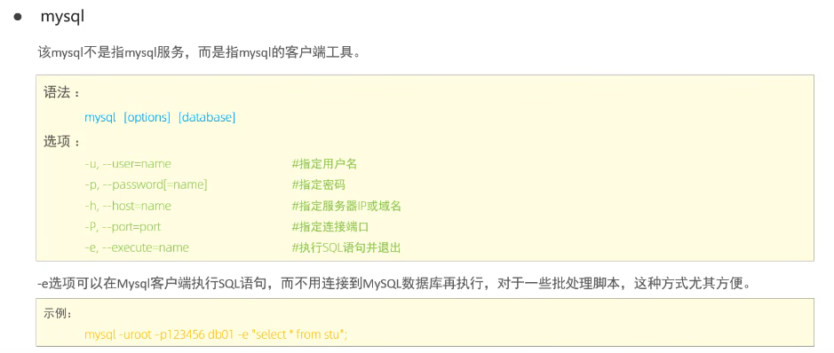
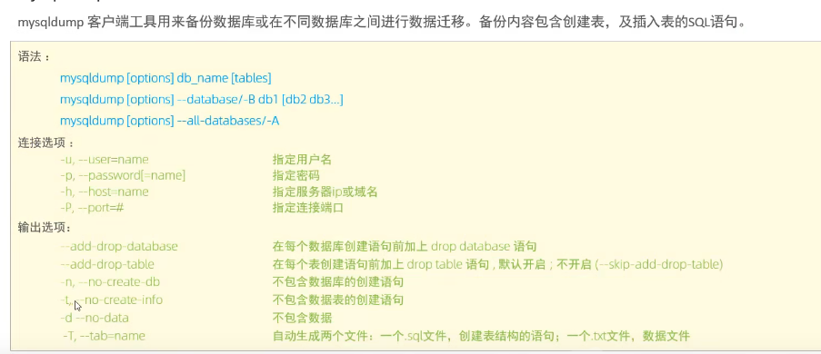

# 系统数据库

# 常用工具

mysql -h127.0.0.1 -P3306 -uroot -ppy12345 itcast -e "select * from emp"

-- mysqladmin 是一个执行管理操作的客户端程序，可以用它来检查服务器的配置和当前状态，创建并删除数据库等。
mysqladmin -uroot -ppy12345 variables
mysqladmin -uroot -ppy12345 create db02
mysql -uroot -ppy12345 -e'show databases'
mysqladmin -uroot -ppy12345 drop db02

-- mysqlbinlog
由于服务器生成的二进制日志文件以二进制格式保存，所以如果想要检查这些文本的文本格式，就会使用到mysqlbinlog日志管理工具。
-- mysqlshow
客户端对象查找工具，很快的查找存在那些数据库，数据库中的表，表中的列或者索引
mysqlshow -uroot -ppy12345 test id --count
查看状态信息
mysqlshow -uroot -ppy12345 test -i

-- mysqldump
用来备份数据库或在不同数据库之间进行数据迁移。备份内容包含创建表，及插入表的SQL语句。
mysqldump  -uroot -ppy12345 test > db01.sql
mysqldump  -uroot -ppy12345 -t test > db02.sql

mysqldump -uroot -ppy12345 -T  /var/lib/mysql-files/ itcast emp 

-- mysqlimport/source 
数据导入工具，用来导入mysqldump加-T参数后导出的文本文件
mysqlimport -uroot -ppy12345 -T itcast test  /var/lib/mysql-files/test.txt
source /root/db01.sql

