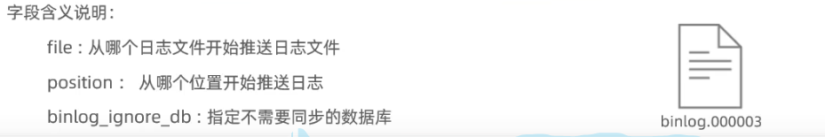
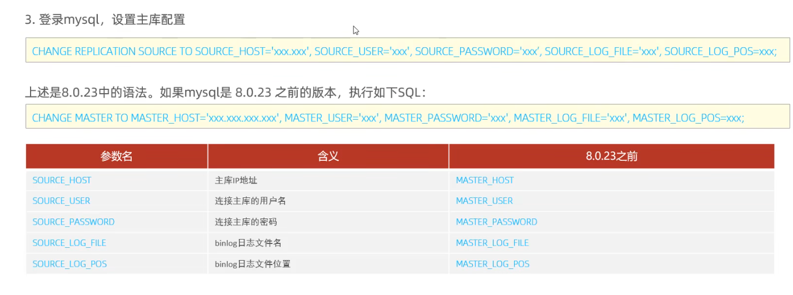

# 配置主库
--关闭防火墙
systemctl stop firewalld
systemctl disable firewalld

sudo gedit /etc/mysql/my.cnf
-- 配置文件
[mysqld]
server-id=1
read-only=0
-- 重启mysql服务
systemctl restart mysql

-- 创建远程连接账号，并赋予主从复制权限
create user 'itcast2'@'%' identified with mysql_native_password by 'Root@123456';
grant replication slave on *.* to 'itcast2'@'%';

-- 查看二进制日志坐标
show master status;

# 配置从库
sudo gedit /etc/mysql/my.cnf
-- 配置文件
[mysqld]
server-id=2 #集群环境中，每个mysql实例的id必须唯一
read-only=1 #1表示只读，0表示可写
-- 重启mysql服务
systemctl restart mysql
-- 设置主库配置
# 主库端口默认是仅接受本地主机的连接，所以需要设置远程连接
[mysqld]
bind-address = 0.0.0.0
-- 两参数都符合，证明配置成功
Replica_IO_Running: Yes
Replica_SQL_Running: Yes

change replication source to source_host='192.168.20.88',source_user='itcast2',source_password='Root@123456',source_log_file='binlog.000007',source_log_pos=157;
-- 开启同步操作
start replica;
show replica status\G;

# 测试
# 从库只会存储连接后主库操作的数据，不会存储连接前主库的数据
# 主从连接后，主库删除数据库，从库会断开连接
-- 主库创建数据库
create database db01;
use db01;
create table tb_user(
    id int(11) primary key not null auto_increment,
    name varchar(50) not null,
    sex varchar(1)
)engine = innodb default charset = utf8mb4;
insert into tb_user(name,sex) values('Tom','1'),('Trigger','0'),('Dawn','1');
