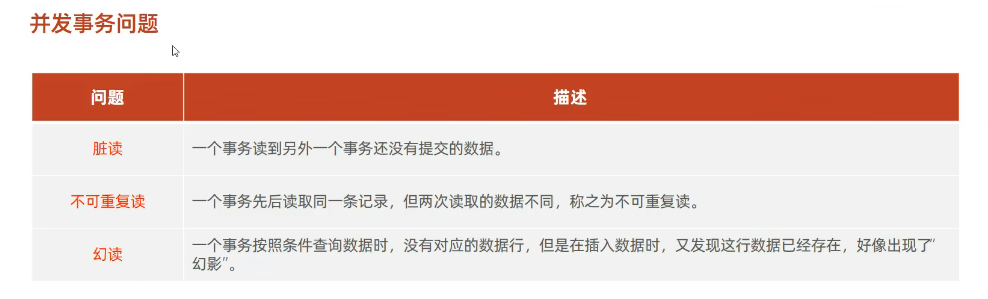

# 事务 是一组操作的集合，它是一个不可分割的工作单位，事务会把所有的操作作为一个整体一起向系统提交或撤销操作请求，即这些操作要么同时成功，要么同时失败
# 数据准备
create table account(
id int auto_increment primary key comment'主键ID',
name varchar(10)comment'姓名',
money int comment'余额'
)comment'账户表';
insert into account(id, name, money) VALUES (null,'张三',2000),(null,'李四',2000);
# --恢复数据
update account set money=2000 where name ='张三' or name ='李四';

# 转账操作

select @@autocommit;
# 设置为手动提交
set @@autocommit = 0;

select * from account where name = '张三';
update account set money = money-1000 where  name = '张三';
update account set money = money+1000 where  name = '李四';

# 提交事务

commit;

# 回滚事务
rollback;

# 方式二
# 开启事务
start transaction;
select * from account where name = '张三';
update account set money = money-1000 where  name = '张三';
程序执行报错 ...
update account set money = money+1000 where  name = '李四';
# 提交事务
commit;
# 回滚事务
rollback;
# 事务四大特性
# 原子性(Atomicity):事务是不可分割的最小操作单元，要么全部成功，要么全部失败。
# 一致性(Consistency):事务完成时，必须使所有的数据都保持一致状态。
# 隔离性(lsolation):数据库系统提供的隔离机制，保证事务在不受外部并发操作影响的独立环境下运行。
# 持久性(Durability):事务一旦提交或回滚，它对数据库中的数据的改变就是永久的。

