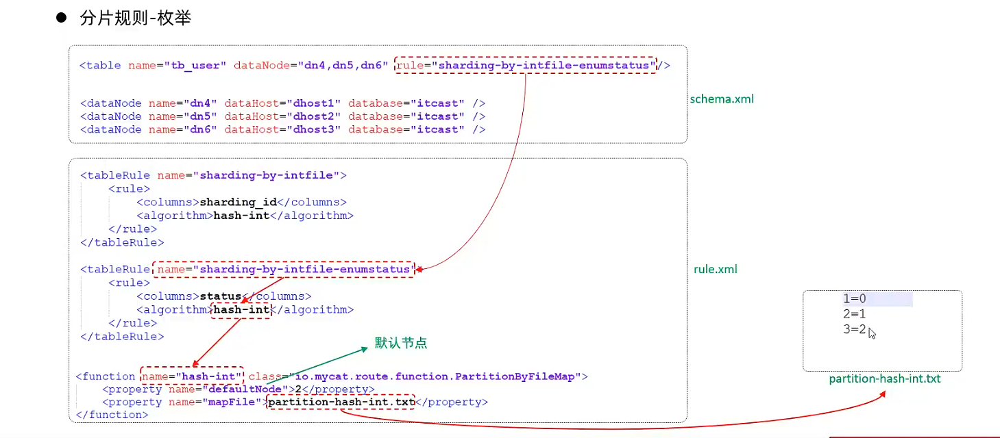

# 垂直拆分

# 水平拆分

# MyCat安装
https://github.com/MyCATApache/Mycat-download/tree/master/1.6-RELEASE

# MyCat概述
-- MyCat 是一个开源的分布式数据库系统，是一个实现了 MySQL 协议的的 Server，前端用户可以把它看作是一个数据库代理，用 MySQL 客户端工具和命令行访问，而其后端可以用 MySQL 原生（Native）协议与多个 MySQL 服务器通信，也可以用 JDBC 协议与大多数主流 Java 数据库连接池整合。
-- 不存储数据，只进行数据分片，真正的数据存储在 MySQL 服务器中。MyCat 通过一个 Proxy 代理层接收 MySQL 客户端请求，然后将请求转发给后端 MySQL 服务器，并将从后端取回的结果返回给客户端，因此，MyCat 也可以被看作是一个 MySQL 服务器。

# MyCat配置
## server.xml
<user name="root">
		<property name="password">123456</property>
		<property name="schemas">DB01</property>
		
		<!-- 表级 DML 权限设置 -->
		<!-- 		
		<privileges check="false">
			<schema name="TESTDB" dml="0110" >
				<table name="tb01" dml="0000"></table>
				<table name="tb02" dml="1111"></table>
			</schema>
		</privileges>		
		 -->
	</user>

	<user name="user">
		<property name="password">123456</property>
		<property name="schemas">DB01</property>
		<property name="readOnly">true</property>
	</user>

## schema.xml
<?xml version="1.0"?>
<!DOCTYPE mycat:schema SYSTEM "schema.dtd">
<mycat:schema xmlns:mycat="http://io.mycat/">

	<schema name="DB01" checkSQLschema="false" sqlMaxLimit="100">
		<!-- auto sharding by id (long) -->
		<table name="TB_ORDER" dataNode="dn1,dn2,dn3" rule="auto-sharding-long" />
	</schema>
	<dataNode name="dn1" dataHost="dhost1" database="db01" />
	<dataNode name="dn2" dataHost="dhost1" database="db01" />
	<dataNode name="dn3" dataHost="dhost1" database="db01" />
	
	<dataHost name="dhost1" maxCon="1000" minCon="10" balance="0"
			  writeType="0" dbType="mysql" dbDriver="jdbc" switchType="1"  slaveThreshold="100">
		<heartbeat>select user()</heartbeat>

		<writeHost host="hostS1" url="jdbc:mysql//192.168.20.88:3316?useSSL=false&amp:serverTimezone=Asia/Shanghai&amp:characterEncoding=utf8" user="root"
				   password="py12345" />
	</dataHost>
	
	<writeHost host="hostS2" url="jdbc:mysql//192.168.20.99:3316?useSSL=false&amp:serverTimezone=Asia/Shanghai&amp:characterEncoding=utf8" user="root"
				   password="py12345" />
	</dataHost>
	
	<writeHost host="hostS3" url="jdbc:mysql//192.168.20.157:3316?useSSL=false&amp:serverTimezone=Asia/Shanghai&amp:characterEncoding=utf8" user="root"
				   password="py12345" />
	</dataHost>

    # 测试
    --启动mycat
    /usr/local/mycat$ bin/mycat start
    --验证是否启动
    tail -f logs/wrapper.log 
    --连接mycat
    mysql -uroot -p123456 -h 192.168.20.88 -P 8066 -u root -ppy12345
    --测试
    show databases;
    show tables;
    use DB01;
    show tables;
    
    --创建表,在mycat中创建表，底层也会创建表
    CREATE TABLE `tb_order` (
      `id` int(11) NOT NULL AUTO_INCREMENT,
      `name` varchar(255) DEFAULT NULL,
      `age` int(11) DEFAULT NULL,
      `sex` varchar(255) DEFAULT NULL,
      PRIMARY KEY (`id`)
    ) ENGINE=InnoDB AUTO_INCREMENT=1 DEFAULT CHARSET=utf8;
# mycat配置
-- schema.xml
涵盖mycat的逻辑库、逻辑表、数据节点、分片规则、分片节点等内容
schema标签
定义了mycat的逻辑库，checkSQLschema在SQl语句操作时指定了数据库名称，执行时是否自动去除，sqlMaxLimit属性定义了查询返回的最大记录数，defaultSchema属性定义了默认的逻辑库
table标签
定义了mycat的逻辑表，name属性定义了逻辑表名称（逻辑库下唯一），dataNode属性定义了逻辑表对应的数据节点，rule属性定义了逻辑表对应的分片规则，primaryKey属性定义了逻辑表的主键，type属性定义了逻辑表的类型，autoIncrement属性定义了逻辑表是否自增
dataNode标签
定义了mycat的数据节点，dataHost属性定义了数据节点所在的主机，database属性定义了数据节点对应的物理数据库，name属性定义了数据节点的名称
dataHost标签
定义了mycat的数据主机，balance属性定义了读写分离策略，writeType属性定义了写操作分发方式，dbType属性定义了数据库类型，dbDriver属性定义了数据库驱动，name属性定义了数据主机的名称，maxCon属性定义了最大连接数，minCon属性定义了最小连接数，url属性定义了数据库连接地址，user属性定义了数据库连接用户名，password属性定义了数据库连接密码

-- rule.xml
定义了mycat的分片规则
tableRule标签
定义了mycat的分片规则，name属性定义了分片规则的名称，columns属性定义了分片规则对应的列，rule属性定义了分片规则对应的算法
function标签
定义了mycat的分片算法，name属性定义了分片算法的名称，class属性定义了分片算法的类名，property属性定义了分片算法的属性
-- server.xml
定义了mycat的配置信息，如用户名、密码、虚拟逻辑库等
system标签
定义了mycat的系统配置，如字符集、端口等
user标签
定义了mycat的用户配置，如用户名、密码、权限（就近原则）等
schema标签
定义了mycat的逻辑库配置，如逻辑库名称、用户权限等
# mycat分片规则
1. 垂直分库

--测试
bin/mycat start
tail -f /logs/wrapper.log

导入脚本，创建表，插入数据
source、root/shopping-table.sql
source、root/shopping-insert.sql
-- 多表查询
select ua.user_id,ua.contact,p.province,c.city,r.area,ua.address from tb_user_address ua,tb_areas_provinces p,tb_areas_city c ,tb_areas_region r where ua.province_id = p.provinceid and ua.city_id = c.cityid and ua.town_id = r.areaid and ua.user_id = 1;

-- 全局表配置
schemal.xml配置table标签dataNode在三张表中都有，type=global表示全局表。
全局表其中一个更新，其他表都会更新。
2. 水平分表

3. 范围分片
根据指定字段及其配置的范围与数据节点的对应情况来决定该数据属于哪一个分片。超出范围的数据，mycat会报错。

4. 取模分片
根据指定字段与节点数量进行求模运算，根据运算结果，决定数据哪一个分片。

5. 一致性hash分片
主键是类似uuid时，使用一致性哈希分片。
一致性哈希：相同的哈希计算值总是被映射到同一个节点上，当节点数量发生变化时，原来数据分区位置不会改变。

6. 枚举分片
通过在配置文件中配置可能的枚举值，指定数据分布到不同数据节点，适用于省份、性别、状态拆分数据等业务。

-- 插入异常数据报错，需要配置defaultNode
7. 应用指定算法
运行阶段由应用自行决定路由到哪一个分片，直接根据字符（数字）子串计算分片号。

8. 固定hash算法
类似十进制求模，但采用二进制进行计算，例如取id的二进制低10位于1111111111进行位&运算。
--特点：
分片字段必须是数字类型。
可以均匀分配，也可以非均匀分配。
如果是求模，连续的值，分别分配到各个不同的分片；但是此算法会将连续的值可能分配到相同的分片，降低事务处理的难度

9. 字符串hash解析算法
截取字符串中的指定位置的子字符串，进行hash运算，算出分片。

10. 按天分片

11. 按自然月分片

# mycat管理及监控
1. mycat原理

2. mycat管理
mycat默认开通两个端口，可以在server.xml中配置
8066：数据访问端口，进行DML和DDL操作
9066: 数据管理端口，用于管理mycat的集群状态。

3. mycat监控

