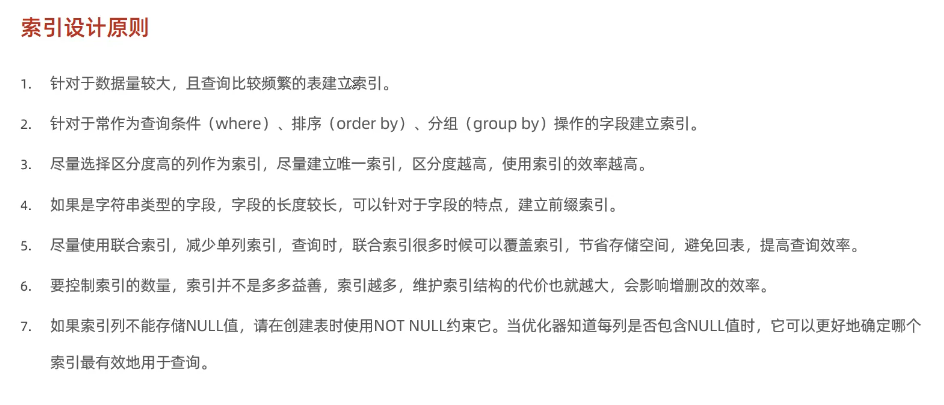

--创建索引
create index idx_sku_sn on tb_sku(sn);
--查询索引
show index from tb_sku;
# 通过对sn设置索引提升查询速度
select * from tb_sku where sn = '100000003145001'\G;

# 最左前缀法则 
-- 使用联合索引查询时，条件要包含最左边的索引，才能使用，否则无法使用索引，同时不能跳过其中某一列，跳过后后面字段索引失效。
-- 联合索引中，使用范围> <索引，后面索引失效。因此尽量使用>= , <=
-- 索引上使用运算也会失效，降低效率
-- 字符串不加单引号，会进行格式转换，索引将失效
-- 头部模糊匹配会导致索引失效，尾部不会
-- or连接 只有两侧条件都有索引，索引才会生效
# 数据分布影响
-- 如果MySQL评估使用索引比全表索引慢，则不使用索引
# SQL提示
- use index: 建议
explain select * from tb_user use index(idx_user_pro) where profession = '软件工程';
- ignore index:

- force index:

# 覆盖索引

# 前缀索引
--将字符串一部分前缀建立索引
-- 前缀索引性计算
select count(distinct substring(email,1,5))/count(*) from tb_user;
-- 截取前缀
create index idx_email_3 on tb_user(email(3));
-- 针对存在多个查询条件，针对字段建立索引更倾向与建立联合索引，不是单列索引

