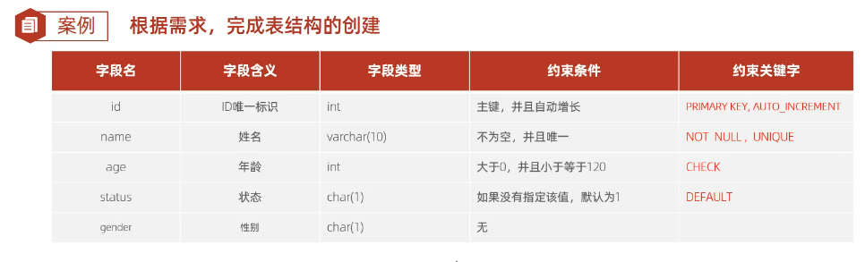

# 约束是作用于表中字段上的规则，用于限制存储在表中的数据

create table user(
    id int primary key auto_increment comment '主键',
    name varchar(10) not null unique comment '姓名',
    age int check (age >0 and age <=120) comment '年龄',
    status char(1) default '1' comment '状态',
    gender char(1)  comment'性别'
)comment '用户表';
# 插入数据
insert into user(name,age,status,gender) values ('Tom1',19,1,'男'),('Tom2',25,0,'男');
insert into user(name,age,status,gender) values ('Tom3',19,1,'男');

insert into user(name,age,status,gender) values ('Tom4',80,1,'男');

# 外键约束
create table dept(
id int auto_increment comment 'ID' primary key,
name varchar(50)not null comment'部门名称')comment'部门表';
INSERT INTo dept (id, name)VALUES(1,'研发部'),(2,'市场部'),(3,'财务部'),(4,'销售部'),(5,'总经办');

create table emp(
id int auto_increment comment 'ID' primary key,
name varchar(50)not null comment'姓名',
age int comment'年龄',
job varchar(20)comment'职位',
salary int comment'薪资',
entrydate date comment'入职时间',
managerid int comment'直属领导ID',
dept_id int comment '部门ID'
)comment'员工表';
INSERT INTo emp (id, name, age, job,salary, entrydate, managerid, dept_id) VALUES(1,'金庸',66,'总裁',20000,'2000-01-01',null,5),(2,'张无忌',20,'项目经理',12500,'2005-12-05',1,1),
                                                                                 (3,'杨逍',33,'开发',8400,'2000-11-03',2,1),(4,'韦一笑',48,'开发',11000,'2002-02-05',2,1),
                                                                                 (5,'常遇春',43,'开发',10500,'2004-09-07',3,1),(6,'小昭',19,'程序员鼓励师',6600,'2004-10-12',2,1);
# 添加外键 保证数据一致性/完整性
alter table emp add constraint fk_emp_depth_id foreign key (dept_id) references dept(id);
# 删除外键
alter table emp drop foreign key fk_emp_depth_id;

# 外键删除和更新行为 cascade
alter table emp add constraint fk_emp_depth_id foreign key (dept_id) references dept(id) on update cascade  on delete cascade ;

# set null
alter table emp add constraint fk_emp_depth_id foreign key (dept_id) references dept(id) on update set null on delete set null ;
