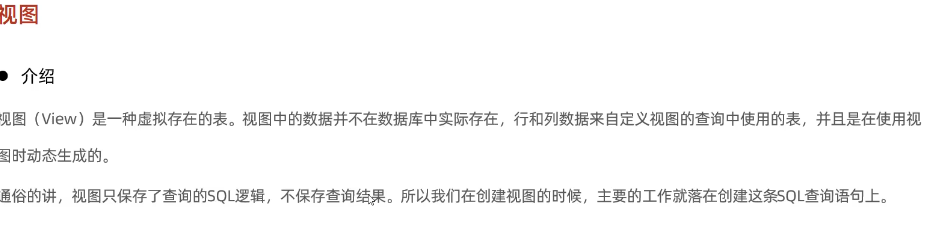
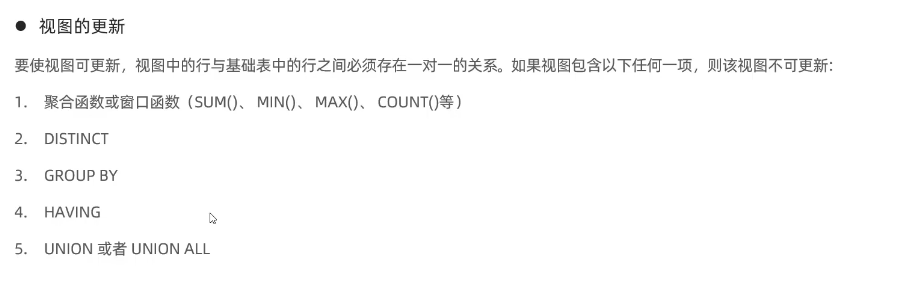

# 创建视图
create or replace view stu_v_1 as select id,name from student where id <=10;
# 查询视图
show create view stu_v_1;
select * from stu_v_1 where id<3;
# 修改视图

create or replace view stu_v_1 as select id,name,no from student where id <=10;
alter view stu_v_1 as select id,name from student where id <=10;

# 删除视图
drop view  if exists stu_v_1; 
# 插入数据时会检查条件 cascaded/local,
create or replace view stu_v_1 as select id,name from student where id <=20 with cascaded check option ;
# 插入数据直接插入表中
insert into stu_v_1 values (6,'Tom');

# cascaded 检查当前视图以及所依赖的视图
create or replace view stu v 1 as select id,name  from student where id <= 20;
insert into stu_v 1 values(5,'Tom');
insert into stu_v_1 values(25,'Tom');
create or replace view stu_v_2 as select id,name from stu_v 1 where id >= 10 with cascaded check option ;
insert into stu_v_2 values(7,'Tom');
insert into stu_v_2 values(26,'Tom');
insert into stu_v_2 values(15,'Tom');
create or replace view stu_v_3 as select id,name from stu_v 2 where id <= 15 ;
insert into stu_v_3 values(11,'Tom');
insert into stu_v_3 values(17,'Tom');
insert into stu_v_3 values(28,'Tom');

# local 只检查定义条件（local）的依赖的视图
create or replace view stu_v_4 as select id,name from student where id <= 15 with local check option;
insert into stu_v_4 values(5,'Tom');
insert into stu_v_4 values(16,'Tom');
create or replace view stu_v_5 as select id,name from stu_v_4 where id >= 10 with local check option ;
insert into stu_v_5 values(13,'Tom');
insert into stu_v_5 values(17,'Tom');
insert into stu_v_5 values(18,'Tom');
create or replace view stu_v_6 as select id,name from stu_v_5 where id < 20 ;
insert into stu_v_6 values(14,'Tom');

作用
简单
视图不仅可以简化用户对数据的理解，也可以简化他们的操作。那些被经常使用的查询可以被定义为视图，从而使得用户不必为以后的操作每次指定全部的条件。

安全
数据库可以授权，但不能授权到数据库特定行和特定的列上。通过视图用户只能查询和修改他们所能见到的数据

数据独立
视图可帮助用户屏蔽真实表结构变化带来的影响。

案例:
--1.为了保证数据库表的安全性，开发人员在操作tb_user表时，只能看到的用产的基本字段，屏做手机号和邮箱两个字段。
create view  tb_user_view as select id,name,profession,age,gender,status,creatatime from tb_user;
select * from tb_user_view;
--查询每个学生所选修的课程(三张表联査)，这个功能在很多的业务中都有使用到，为了简化操作，定义一个规图。
create view tb_stu_course_view as select  s.name student_name,s.no student_no,c.name course_name from student s,student_course sc,course c where s.id = sc.studentid and sc.courseid = c.id;
select * from tb_stu_course_view;

