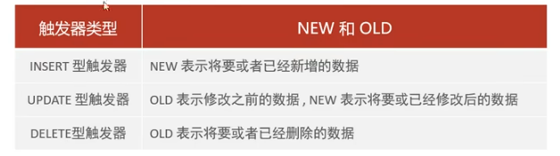

-- 触发器是与表有关的数据库对象，指在 insert/update/delete 之前或之后，触发并执行触发器中定义的SQL语句集合。触发器的这种特性可以协助应用在数据库端确保数据的完整性，日志记录，数据校验等操作:。
-- 使用别名 OLD 和 NEW 来引用触发器中发生变化的记录内容，这与其他的数据库是相似的。现在触发器还只支持行级触发，不支持语句级触发。

-- 创建
create table user_logs(
id int(11) not null auto_increment,
operation varchar(20) not null comment '操作类型,insert/update/delete',
operate_time datetime not null comment'操作时间',
operate_id int(11) not null comment'操作的ID',
operate_params varchar(500) comment '操作参数',
primary key(id)
)engine=innodb default charset=utf8;
-- 插入数据触发器
create trigger tb_user_insert_trigger
    after insert on tb_user for each row
begin
        insert into user_logs(id, operation, operate_time, operate_id, operate_params) values
        (null,'insert',now(),new.id,concat('插入数据为：id = ',new.id,'，name = ',new.name,'，phone = ',new.phone,'，email = ',new.email,'，profession = ',new.profession));
end;
-- 更新触发器
create trigger tb_user_update_trigger
    after update on tb_user for each row
begin
        insert into user_logs(id, operation, operate_time, operate_id, operate_params) values
        (null,'update',now(),new.id,concat('更新之前数据为：id = ',old.id,'，name = ',old.name,'，phone = ',old.phone,'，email = ',old.email,'，profession = ',old.profession,
                '，|更新之后数据为：id = ',new.id,'，name = ',new.name,'，phone = ',new.phone,'，email = ',new.email,'，profession = ',new.profession));
end;
-- 删除触发器
create trigger tb_user_delete_trigger
    after delete on tb_user for each row
begin
        insert into user_logs(id, operation, operate_time, operate_id, operate_params) values
        (null,'delete',now(),old.id,concat('删除之前数据为：id = ',old.id,'，name = ',old.name,'，phone = ',old.phone,'，email = ',old.email,'，profession = ',old.profession));
end;
-- 查看
show triggers;
-- 删除
drop trigger tb_user_insert_trigger;

insert into tb_user(id, name, phone,
email, profession, age, gender, status, creatatime)
VALUES (25,'二皇子','18809091212','erhuangzi@163.com','软件工程',23,'1','1',now());

insert into tb_user(id, name, phone,
email, profession, age, gender, status, creatatime)
VALUES (26,'三皇子','18809091215','erhuangzi@163.com','软件工程',23,'1','1',now());

update  tb_user set age = 20 where id = 23;
update  tb_user set profession = '会计' where id <= 5;

delete from tb_user  where id = 26;
delete from tb_user  where id = 25;