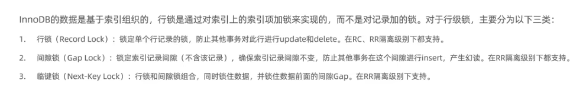
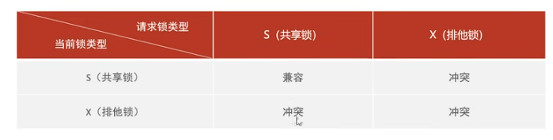
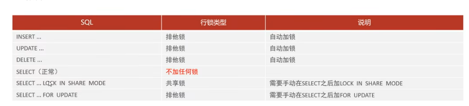

-- 行级锁
每次操作锁住对应的行数据。锁定粒度最小，发生锁冲突的概率最低，并发度最高，应用在InnoDB存储引擎中。

InnoDB实现了以下两种类型的行锁:
共享锁(S):允许一个事务去读一行，阻止其他事务获得相同数据集的排它锁。
排他锁(X):允许获取排他锁的事务更新数据，阻止其他事务获得相同数据集的共享锁和排他锁。

默认情况下，InnODB在 REPEATABLE READ事务隔离级别运行，InnoDB使用 next-key锁进行搜索和索引扫描，以防止幻读
1.针对唯一索引进行检索时，对已存在的记录进行等值匹配时，将会自动优化为行锁。
2.InnoDB的行锁是针对于索引加的锁，不通过索引条件检索数据，那么InnoDB将对表中的所有记录加锁，此时 就会升级为表锁。
-- 对行及锁进行修改时，尽量使用索引进行检索

-- 间隙锁/临间锁
--默认情况下，InnODB在 REPEATABLE READ事务隔离级别运行，InnoDB使用 next-key锁进行搜索和索引扫描，以防止幻读（唯一目的）
1.索引上的等值查询(唯一索引)，给不存在的记录加锁时,优化为间隙锁
2.索引上的等值查询(普通索引)，向右遍历时最后一个值不满足查询需求时，next-key lock退化为间隙锁。
3.索引上的范围查询(唯一索引)--会访问到不满足条件的第一个值为止。
注意:间隙锁唯一目的是防止其他事务插入间隙。间隙锁可以共存，一个事务采用的间隙锁不会阻止另一个事务在同一间隙上采用间隙锁

