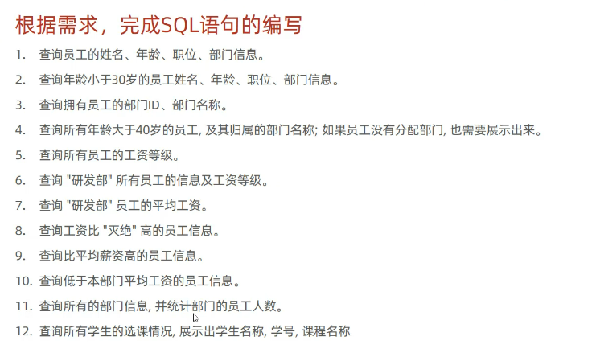

create table salgrade
(
    grade int,
    losal int,
    hisal int
)comment'薪资等级表';
insert into salgrade values(1,0,3000);
insert into salgrade values(2,3001,5000);
insert into salgrade values(3,5001,8000);
insert into salgrade values (4,8001,10000);
insert into salgrade values(5,10001,15000);
insert into salgrade values(6,15001,20000);
insert into salgrade values(7,20001,25000);
insert into salgrade values(8,25001,30000);

#  1. 查询员工的姓名、年龄、职位、部门信息 (隐式内连接)
select e.name,e.age,e.job,d.name from emp e,dept d where e.dept_id = d.id;
#--2.查询年龄小于30岁的员工的姓名、年龄、熙位、部门信息(显示内连接)
select e.name,e.age,e.job,d.name from emp e inner join  dept d on e.dept_id = d.id where e.age < 30;
#--3.查询拥有员工的部门ID、部门名称
select distinct d.*  from emp e,dept d where e.dept_id = d.id;
#  4.查询所有年龄大于40岁的员工，及其归属的部门名称;如果员工没有分配部门，也需要展示出来
select *  from emp e left join dept d on e.dept_id = d.id where e.age > 40;
#  5.查询所有员工的工资等级
select e.name,s.grade,s.losal,s.hisal  from emp e , salgrade s where e.salary >= s.losal and e.salary <= s.hisal;

select e.name,s.grade,s.losal,s.hisal  from emp e , salgrade s where e.salary between s.losal and s.hisal;

# 6.查询“研发部”所有员工的信息及 工资等级
select e.*, s.grade
from emp e,
     dept d,
     salgrade s
where e.dept_id = d.id
  and d.name = '研发部'
  and e.salary between s.losal and s.hisal;
#--7.查询“研发部”员工的平均工资
select avg(e.salary)
from emp e,
     dept d
where e.dept_id = d.id
  and d.name = '研发部';
# 8.查询工资比"灭绝"高的员工信息。
select *
from emp e
where e.salary >(select e.salary from emp e where e.name = '灭绝') ;
# 9.查询比平均薪资高的员工信息。
select *
from emp e
where e.salary >(select avg(e.salary) from emp e) ;
# 10.查询低于本部门平均工资的员工信息。
select *
from emp e2
where e2.salary  <(select avg(e.salary) from emp e ,dept d where e.dept_id = e2.dept_id) ;
# 11.查询所有的部门信息,并统计部门的员工人数。
select d.* , (select count(*) from emp e where e.dept_id = d.id) '人数' from dept d;
# 12.查询所有学生的选课情况,展示出学生名称,学号,课程名称
select s.name,s.no,c.name
from student s,
     student_course sc,
     course c
where s.id = sc.studentid and sc.courseid = c.id;