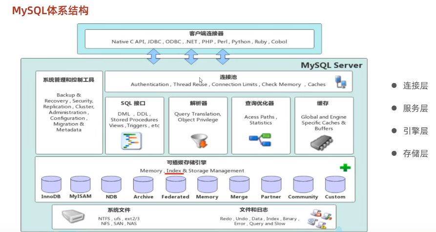
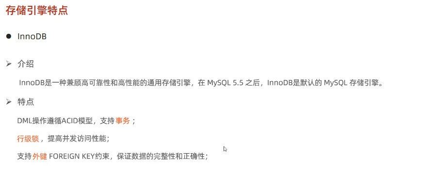
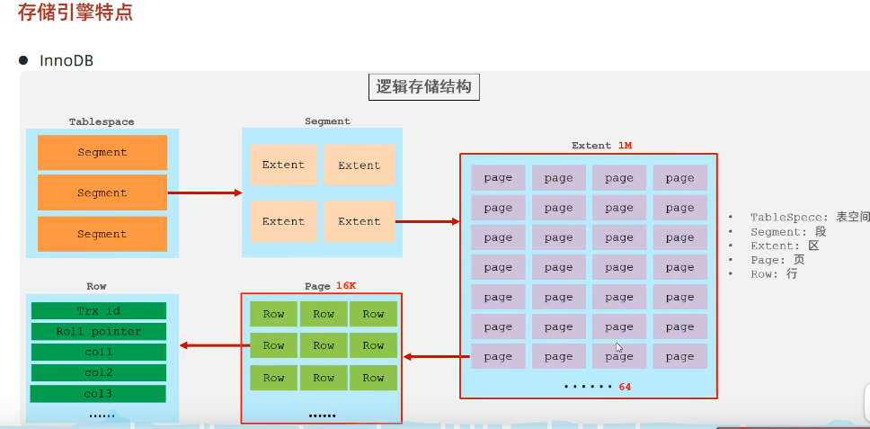
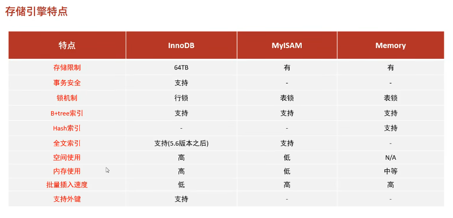

# 存储引擎就是存储数据、建立索引、更新/查询数据等技术的实现方式。存储引擎是基于表的，而不是基于库的，所以存储引擎也可被称为表类型。

# 查询建表语句
show create table my_myisam;

# 查询当前数据库支持的存储引擎
show engines;
# 创建表，并指定引擎
create table my_myisam(
    id int,
    name varchar(10)
)engine = MyISAM;

create table my_memory(
    id int,
    name varchar(10)
)engine = Memory;

