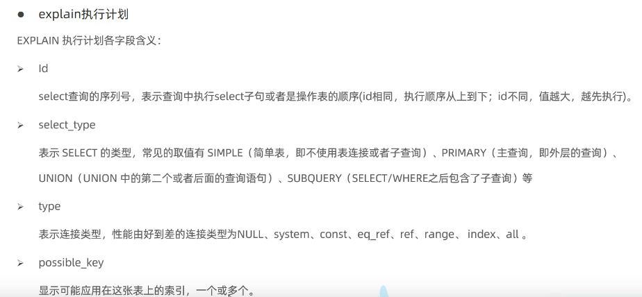
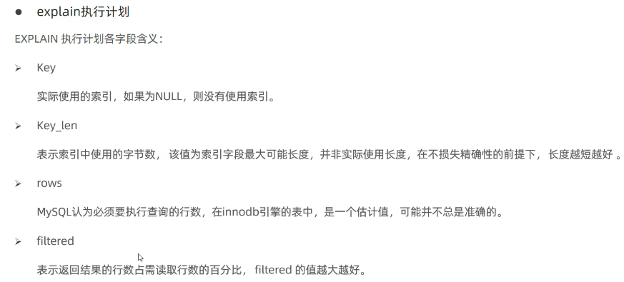

# 查看执行频次
show global status like 'Com_______';

# 慢查询日志记录了所有执行时间超过指定参数(long querytime，单位:秒，默认10秒)的所有SOL语句的日志。
MySOL的慢查询日志默认没有开启，要在MySQL的配署文件(/etc/mysql/mycnf)中配置如下信息
查询开启
show variables like 'slow_query_log';

# 性能分析
select @@have_profiling;
select @@profiling;
set profiling =1;
show profiles;
--分析逐步时间
show profile for query 8;
--cpu使用情况
show profile cpu for query 8;
# explain 性能分析

