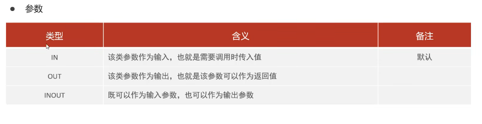
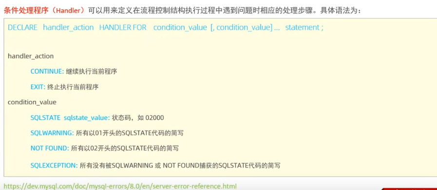

# 存储过程
存储过程是事先经过编译并存储在数据库中的一段 SQL语句的集合，调用存储过程可以简化应用开发人员的很多工作，减少数据在数据库和应用服务器之间的传输，对于提高数据处理的效率是有好处的。
存储过程思想上很简单，就是数据库 SQL语言层面的代码封装与重用。
# 特点
封装，复用
可以接收参数，也可以返回数据
减少网络交互，效率提升

-- 存储过程基本语法
-- 创建
create procedure p1()
begin
    select  count(*) from student;
end;
-- 调用
call p1();
-- 查看
-- 查看mysql存储表中所有
select * from information_schema.ROUTINES where ROUTINE_SCHEMA = 'itheima';
-- 查看指定创建过程
show create procedure p1;
-- 删除
drop procedure if exists p1;
-- 终端中使用创建指令需要delimiter指令，指定结束符号
delimiter $$
create procedure p1()
begin
    select  count(*) from student;
end$$
delimiter ;

# 变量
-- 系统变量是MVSQL服务器提供，不是用户定义的，属于服务器层面。分为全局变量(GLOBAL)、会话变量(SESSION)--仅在当前会话中定义，默认
-- 变量:系统变量
-- 查看系统变量
show variables;
show session variables like'auto%';
show global variables like'auto%';
select  @@global.autocommit;
select  @@session.autocommit;
-- 设置系统变量
set session autocommit =0;
set global autocommit =1;# 重启后恢复为初始值
-- 想要永久生效需要配置my.cnf文件

-- 用户定义变量时用户根据需要自己定义变量，用户变量不用提前声明，在用的时候直接用“@变量名”使用，其作用域为当前连接。
-- 赋值

set @myname = 'itcast';
set @myage := 10;
set @mygender := '男',@myhobby := 'java';

select @mycolor := 'red';
select count(*) into @mycount from student;
-- 使用
select @myname,@myage,@mygender,@myhobby;

select @mycolor,@mycount;
-- 用户自定义变量无需声明或初始化，只不过获取值为NULL。

-- 局部变量 是根据需要定义的在局部生效的变量，访问之前，需要DECLARE声明。可用作存储过程内的局部变量和输入参数，局部变量
的范围是在其内声明的BEGIN . END块。
-- 声明
declare
-- 赋值
create procedure p2()
begin
    declare stu_count int default 0;
    select count(*) into stu_count from student;
    select stu_count;
end;

call p2();

-- if判断
create procedure p3()
begin
    declare score int default 58;
    declare result varchar(10);
    if score >= 85 then
        set result :='优秀';
    elseif score >= 60 then
         set result :='及格';
    else
        set result :='不及格';
    end if;
    select result;
end;

call p3();

-- 参数
create procedure p4(IN score int,OUT result varchar(10))
begin
    if score >= 85 then
        set result :='优秀';
    elseif score >= 60 then
         set result :='及格';
    else
        set result :='不及格';
    end if;
end;

call p4(98,@result);
select @result;

-- 200分制，转换成百分制返回
create procedure p5(inout score double)
begin
    set score := score  * 0.5;
end;

set @score = 178;
call p5(@score);
select @score;

-- case
create procedure p6(in month int)
begin
    declare result varchar(10);
    case
    when month >=1 and month <=3  then
        set result := '第一季度';
    when month >=4 and month <=6  then
        set result := '第二季度';
    when month >=7 and month <=9  then
        set result := '第三季度';
    when month >=10 and month <=12  then
        set result := '第四季度';
    else
        set result := '非法参数';
    end case;
    # 拼接字段
    select concat('您输入的月份为：',month,'，所属季度为：',result);
end;
call p6(5);

-- 循环
-- while 满足条件继续循环
create procedure p7(in n int)
begin
    declare total int default 0;
    while n>0 do
        set total := total + n;
        set n := n-1;
        end while;
    select total;
end;
call p7(100);
-- repeat 满足条件退出循环
create procedure p8(in n int)
begin
    declare total int default 0;
    repeat
        set total := total + n;
        set n := n-1;
    until n<=0
    end repeat;
    select total;
end;
call p8(100);

-- loop
-- LOOP 实现简单的循环，如果不在SQL逻辑中增加退出循环的条件，
-- 可以用其来实现简单的死循环。
-- LOOP可以配合一下两个语句使用:
-- LEAVE:配合循环使用，退出循环。
-- ITERATE:必须用在循环中，作用是跳过当前循环剩下的语句，直接进入下一次循环。
create procedure p9(in n int)
begin
    declare total int default 0;
    sum:loop

    if n<=0 then
        leave sum;
    end if;
    set total := total + n;
    set n := n-1;
    end loop sum;
    select total;
end;
call p9(10);

-- 偶数累加
create procedure p10(in n int)
begin
    declare total int default 0;
    sum:loop

    if n<=0 then
        leave sum;
    end if;
    if n%2 = 1 then
        set n := n-1;
        iterate sum;
    end if;
    set total := total + n;
    set n := n-1;
    end loop sum;
    select total;
end;
call p10(100);

-- 游标
游标(CURSOR)
是用来存储查询结果集的数据类型,在存储过程和函数中可以使用游标对结果集进行循环的处理。游标的使用包括游标
的声明、OPEN、FETCH和CLOSE

create procedure p11(in uage int)
begin
    declare u_name varchar(100);
    declare u_pro varchar(100);
    declare u_cursor cursor for select name,profession from tb_user where age <= uage;
    drop table if exists tb_user_pro;
    create table if not exists tb_user_pro(
        id int primary key auto_increment,
        name varchar(100),
        professionb varchar(100)
    );
    open u_cursor;
    while true do
        fetch u_cursor into u_name,u_pro;
        insert into tb_user_pro values (null,u_name,u_pro);
    end while;
    close u_cursor;
end;
call p11(40);

-- 条件处理程序 handler
条件处理程序(Handler)可以用来定义在流程控制结构执行过程中遇到问题时相应的处理步骤。

create procedure p11(in uage int)
begin
    declare u_name varchar(100);
    declare u_pro varchar(100);
    declare u_cursor cursor for select name,profession from tb_user where age <= uage;
    declare exit handler for SQLSTATE '02000' close u_cursor;
    drop table if exists tb_user_pro;
    create table if not exists tb_user_pro(
        id int primary key auto_increment,
        name varchar(100),
        profession varchar(100)
    );
    open u_cursor;
    while true do
        fetch u_cursor into u_name,u_pro;
        insert into tb_user_pro values (null,u_name,u_pro);
    end while;
    close u_cursor;
end;
call p11(40);
drop procedure p11;

create procedure p12(in uage int)
begin
    declare u_name varchar(100);
    declare u_pro varchar(100);
    declare u_cursor cursor for select name,profession from tb_user where age <= uage;
    declare exit handler for not found close u_cursor;
    drop table if exists tb_user_pro;
    create table if not exists tb_user_pro(
        id int primary key auto_increment,
        name varchar(100),
        profession varchar(100)
    );
    open u_cursor;
    while true do
        fetch u_cursor into u_name,u_pro;
        insert into tb_user_pro values (null,u_name,u_pro);
    end while;
    close u_cursor;
end;

