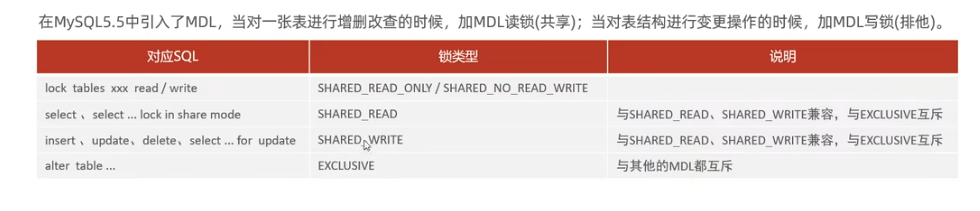

-- 表级锁，每次操作锁住整张表。锁定粒度大，发生锁冲突的概率最高，并发度最低。应用在MVISAM、InnoDB、BDB等存储引擎中。
对于表级锁，主要分为以下三类:
1.表锁
2.元数据锁(meta data lock，MDL)
3.意向锁

-- 表锁分为：表共享读锁（read lock），表独占写锁（write lock）
-- 加锁
-- 读锁，当前和其他客户端都只能读数据，其他客户端写会阻塞，直到释放锁，当前客户端报错
lock tables emp read;
update emp set name = '树人' where id = 16;
-- 写锁 ，当前客户端可以读和写，其他客户端无法读写

-- 释放锁
unlock tables;

-- 元数据锁
MDL加锁过程是系统自动控制，无需显式使用，在访问一张表的时候会自动加上。MDL锁主要作用是维护表元数据的数据一致性，在表
上有活动事务的时候，不可以对元数据进行写入操作。避免dml和ddl冲突，保证读写正确性。

-- 查看元数据锁

select object_type,object_schema,object_name,lock_type,lock_duration from performance_schema.metadata_locks;

-- 意向锁
为了避免DML在执行时，加的行锁与表锁的冲突，在InnoDB中引入了意向锁，使得表锁不用检查每行数据是否加锁，使用意向锁来减
少表锁的检查

-- 意向共享锁(IS):由语句 select..lock in share mode添加。与表锁共享锁（read）兼容，表锁排他锁（write）互斥
-- 意向排他锁(IX):由insert、update、delete、select...for update 添加。与表锁共享锁（read），表锁排他锁（write）都互斥，意向锁之间不会互斥

-- 查看意向锁以及行锁的加锁情况：
select * from emp where id =1 lock in share mode;
select object_schema,object_name,index_name,lock_type,lock_mode,lock_data from performance_schema.data_locks;
lock tables emp read;

